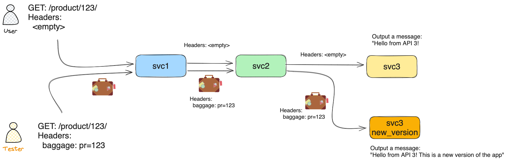

# Control routing with Baggage header

## Demo

In this demo, you will learn how to use the baggage header to control the routing of your services.

Architecture:



Clone the repository

```bash
git clone git@github.com:antonioberben/test-in-production.git
cd test-in-production 
```

Deploy Istio

```bash
istioctl install -f ./k8s/istio-values.yaml -y
```

Deploy the services

```bash
kubectl create ns my-system

kubectl label namespace my-system istio.io/rev=1-21 --overwrite

kubectl apply -f ./k8s/app.yaml
kubectl apply -f ./k8s/app3-new-version.yaml
```

Deploy the Istio Resources

```bash
kubectl apply -f ./k8s/istio-virtualservice.yaml
```

Test the services

```bash
kubectl port-forward -n my-system svc/app1 5000
```

And then

```bash
curl localhost:5000/product/123
```

You will see the response from `app1`, `app2` and `app3` together:

```text
Hello from API 1!
Hello from API 2!
Hello from API 3!
```

Now, adding the baggage header which will be propagated across the services:

```bash
curl localhost:5000/product/123 -H "baggage: pr=123"
```

You will see the response from `app3` with the `blue` version:

```text
Hello from API 1!
Hello from API 2!
Hello from API 3! This is a new version of the app
```

Checking the logs for the proxy,

```bash
kubectl logs -n my-app deploy/app3 -n my-system -c istio-proxy --tail 1
```

You will see outputted the baggage header that was passed to the application. Notice that app1 added some extra baggage.
  
```text
[ACCES_LOGS] "baggage": "x=1,pr=123,product-id=123,other-baggage=value2,another-baggage=3,url-baggage=%2Ftest%2F1%3Fattr%3D1" "authority": "app3.my-system.svc.cluster.local:5000" "method": "GET" "path": "/"
```

## Interesting links

- [Official OpenTelemetry Propagation](https://opentelemetry.io/docs/languages/python/propagation/)
- [Easy article which explains propagation with Baggage header](https://trstringer.com/otel-part5-propagation/)
- [OpenTelemetry Baggage header](https://opentelemetry.io/docs/concepts/signals/baggage/)
- [Use-case: How Lyft leverages Baggage header for their system](https://youtu.be/p9dYr23MVv0?t=683)
